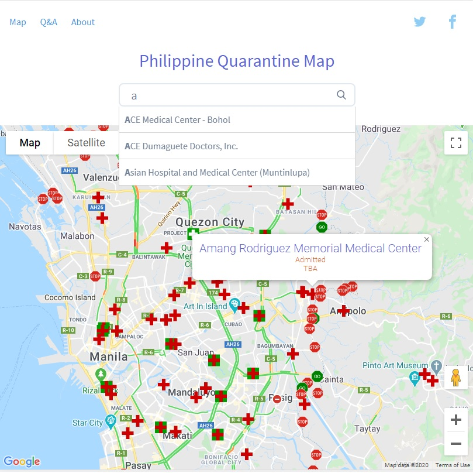
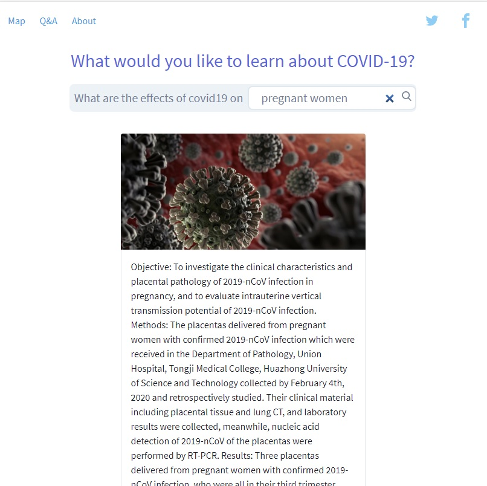

# PH Quarantine Checkpont Map

## Getting Started

Choose one of the following options to get started:
* Clone the repo: `git clone https://github.com/tailwindtoolbox/App-Landing-Page.git`
* Fork the repo

## Using the Template

The template is just a HTML file using a full CDN hosted Tailwind CSS file.

To get the best out of Tailwind CSS, you need to really start customising it.
Take a look at our [setup guide](https://www.tailwindtoolbox.com/setup) to start tweaking!

## Contributor
1. Prof. Noriel Christopher Tiglao of #UPNCAPG. He is a civil engineer by profession and has conducted research on transportation management and policy with the National Center for Transportation Studies (NCTS). Maraming salamat po sa inyo!
1. Ryan Sandagon. - edited and redesigned the page

* https://twitter.com/rsandagon

##  DOCKER RUN
* API: `docker run -d --name api -p 8000:80 --network=mynetwork rsandagon/manilacovid-api:latest`
* APP: `docker run -d --name manilacovid -p 8080:80 --network=mynetwork rsandagon/manilacovid:latest`

docker run -d --name manilacovidTemp -p 80:80 --network=mynetwork rsandagon/manilacovid:latest

##  HOW TO START manilacovid
1. Build manilacovid and manilacovid-api first
    * API: `docker run -d --name api -p 8000:80 --network=mynetwork rsandagon/manilacovid-api:latest`
    * APP: `docker run -d --name manilacovid -p 8080:80 --network=mynetwork rsandagon/manilacovid:latest`
1. got to `cd proxy` to run ssl and proxy handling 
1. run `./init-letsencrypt` to make certifications for ssl
1. run `docker-compose up -d`

## LET'S ENCRYPT
* https://medium.com/@pentacent/nginx-and-lets-encrypt-with-docker-in-less-than-5-minutes-b4b8a60d3a71

## Copyright and License

Copyright 2020 Rsandagon - released under the MIT license.